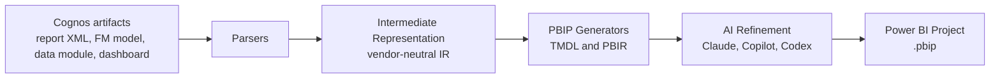

# Cognos to Power BI Migration Tool

**Migrate IBM Cognos reports, models, data modules, and dashboards to Microsoft Power BI
automatically.** An open-source, AI-assisted migration engine that converts Cognos sources into
Power BI Project (PBIP) format using TMDL semantic models and PBIR report definitions.

[](https://github.com/navintkr/cognos-to-powerbi/actions/workflows/ci.yml)
[](LICENSE)
[](https://www.python.org/downloads/)
[](CONTRIBUTING.md)

---

## What this project does

Organizations moving from **IBM Cognos Analytics** to **Microsoft Power BI** face a slow, manual,
error-prone migration. This tool automates the heavy lifting:

1. **Parse** Cognos report specification XML, Framework Manager models, and data modules.
2. **Normalize** them into a vendor-neutral intermediate representation (IR).
3. **Model** the result as a Power BI star schema: classify fact and dimension tables, orient
   relationships, infer cardinality and cross-filter direction, and mark date tables.
4. **Generate** Power BI Project (PBIP) output: TMDL semantic models and PBIR reports.
5. **Refine** the output with an AI assistant (Claude, GitHub Copilot, or Codex) to translate
   expressions, layouts, and visuals that have no direct mechanical mapping.

The result is a Git-friendly Power BI project you can open in Power BI Desktop, review, and deploy
to the Power BI / Microsoft Fabric service.

## Why use it

- **Faster migrations.** Convert hundreds of reports in a fraction of the manual time.
- **Consistent output.** Deterministic, reviewable PBIP artifacts instead of hand-rebuilt reports.
- **AI-assisted, not AI-dependent.** The mechanical conversion works without any AI key; AI only
  refines what cannot be mapped deterministically, and never at the cost of a loadable model.
- **Provider-agnostic AI.** Use Azure OpenAI (Entra ID), Claude Code CLI, GitHub Copilot CLI, or
  OpenAI Codex CLI.
- **Open and extensible.** MIT-licensed, plugin-friendly parsers and generators.

## Supported conversions

| Cognos source | Power BI target | Status |
| --- | --- | --- |
| Report specification (Report Studio XML) | PBIR report + TMDL tables | Available (beta) |
| Queries and data items | TMDL columns and measures | Available (beta) |
| Framework Manager model (`.cpf` / FM XML) | TMDL semantic model | Available (beta) |
| Relational joins | Star-schema relationships with cardinality and cross-filter | Available (beta) |
| Data modules (`.module` JSON) | TMDL semantic model | Available (beta) |
| Dashboards and explorations (JSON) | PBIR report pages | Available (beta) |
| Batch / folder migration | One project per source plus a coverage report | Available (beta) |

The star-schema modeling pass classifies fact, dimension, and date tables, hides foreign keys,
resolves role-playing dimensions and ambiguous filter loops, and flags many-to-many and snowflake
joins for review. Disable it with `--no-infer-model`. See [data modeling](docs/data-modeling.md)
for the full behavior and edge-case handling.

See the [migration coverage matrix](docs/coverage.md) for detail on expressions, filters, and
visual types.

## Quick start

```bash
# Install
pip install cognos2powerbi

# Convert a single Cognos report specification to a Power BI project
cognos2pbi migrate ./examples/sample_report.xml --out ./out/SalesReport

# Point the generated model at your database (refreshable PBIP)
cognos2pbi migrate ./examples/sample_report.xml --out ./out/SalesReport \
  --server sql01.contoso.com --database Sales

# Convert a Cognos Framework Manager model to a Power BI semantic model
cognos2pbi migrate-model ./examples/sample_model.xml --out ./out/SalesModel

# Infer a full star schema (fact/dimension roles, relationships, date tables)
cognos2pbi migrate-model ./examples/star_schema_model.xml --out ./out/RetailStar

# Convert a Cognos data module to a Power BI semantic model
cognos2pbi migrate-module ./examples/sample_data_module.json --out ./out/SalesAnalysis

# Convert a Cognos dashboard to a Power BI report
cognos2pbi migrate-dashboard ./examples/sample_dashboard.json --out ./out/SalesDashboard

# Convert a whole folder of mixed sources, with a coverage report
cognos2pbi migrate-batch ./examples --out ./out/Batch

# Open the generated project
#   ./out/SalesReport/SalesReport.pbip   ->  open in Power BI Desktop
```

Run from source instead:

```bash
git clone https://github.com/navintkr/cognos-to-powerbi.git
cd cognos-to-powerbi
pip install -e ".[dev]"
cognos2pbi migrate ./examples/sample_report.xml --out ./out/SalesReport
```

## End-to-end demo (complex report on local SQL Server)

This walkthrough migrates a complex Cognos report, wires the generated model to a local SQL
Server database, and opens a refreshable Power BI Project. Everything it needs ships in the repo:

- [examples/complex_sales_report.xml](examples/complex_sales_report.xml) - a Cognos report with
  three queries (FactSales, DimProduct, DimDate), typed columns, six aggregate measures
  (including translated arithmetic such as `Gross Profit` and `Net Revenue`), and three pages of
  list, crosstab, column, line, and pie visuals.
- [examples/sql/setup_demo_db.sql](examples/sql/setup_demo_db.sql) - creates the matching
  `CognosDemo` database with sample data. Table and column names line up with the report, so the
  generated PBIP refreshes with no manual edits.

### Step-by-step video

> Walkthrough video: add your recording link here (for example a Loom or YouTube URL).
> Suggested flow to record: run the SQL script, run `cognos2pbi migrate`, open the `.pbip` in
> Power BI Desktop, set the `Server` / `Database` parameters, then Refresh.

### 1. Install the demo database

Requires a local SQL Server instance and `sqlcmd`. Using a default instance with Windows auth:

```powershell
sqlcmd -S localhost -E -C -i examples/sql/setup_demo_db.sql
```

This creates `CognosDemo` with `DimProduct` (6 rows), `DimDate` (6 rows), and `FactSales`
(12 rows).

### 2. Migrate the report and wire it to local SQL

```powershell
cognos2pbi migrate examples/complex_sales_report.xml --out out/ComplexDemo `
  --source-type sqlserver --server localhost --database CognosDemo --schema dbo
```

Expected summary: 3 tables, 6 measures, 3 pages, 0 items to review. The generated model uses
`Server` and `Database` parameters and a `Sql.Database(Server, Database)` partition per table.

### 3. Open and refresh in Power BI Desktop

1. Open `out/ComplexDemo/complex_sales_report.pbip` in Power BI Desktop.
2. If prompted, confirm the `Server` (`localhost`) and `Database` (`CognosDemo`) parameters.
3. Refresh. The measures evaluate against live data, for example:

   | Total Revenue | Gross Profit | Net Revenue | Avg Unit Price | Total Quantity |
   | --- | --- | --- | --- | --- |
   | 1,751,000.00 | 663,000.00 | 1,663,450.00 | 741.67 | 3,810 |

To point at a different server, change `--server` / `--database`, or edit the `Server` and
`Database` parameters in Power BI Desktop after opening the project.

## AI-assisted refinement (optional)

Enable an AI provider to translate complex Cognos expressions (calculated columns and measures)
into Power BI DAX. Azure OpenAI runs over HTTPS with Microsoft Entra ID; the others shell out to
their CLI.

```bash
# Azure OpenAI (Entra ID via az login; install extras first)
pip install "cognos2powerbi[azure]"
cognos2pbi migrate ./report.xml --out ./out/Report --ai azure

# Claude Code CLI
cognos2pbi migrate ./report.xml --out ./out/Report --ai claude

# GitHub Copilot CLI
cognos2pbi migrate ./report.xml --out ./out/Report --ai copilot

# OpenAI Codex CLI
cognos2pbi migrate ./report.xml --out ./out/Report --ai codex
```

If no AI provider is configured, the tool completes a deterministic conversion and flags items that
need manual review. Either way the generated model stays loadable: an expression that cannot be
translated remains a physical column and is listed in `MIGRATION_REVIEW.md` rather than emitted as
invalid DAX. See [docs/ai-providers.md](docs/ai-providers.md).

## How it works



The intermediate representation decouples parsing from generation, so new Cognos inputs and new
Power BI output formats can be added independently. See [docs/architecture.md](docs/architecture.md).

## Project layout

```
cognos-to-powerbi/
├── src/cognos2powerbi/
│   ├── cli.py                 # Command-line interface
│   ├── core/
│   │   ├── ir/                # Vendor-neutral intermediate representation
│   │   ├── parsers/           # Cognos report/model parsers
│   │   ├── generators/        # PBIP (TMDL + PBIR) generators
│   │   ├── translate/         # Deterministic Cognos-to-DAX translation
│   │   ├── ai/                # Provider-agnostic AI adapter
│   │   └── pipeline.py        # Orchestration
│   └── api/                   # FastAPI backend (SaaS surface)
├── web/                       # Single-page web frontend
├── examples/                  # Sample Cognos inputs
├── docs/                      # Documentation
└── tests/                     # Test suite
```

## Run the SaaS API locally

```bash
pip install -e ".[api]"
uvicorn cognos2powerbi.api.main:app --reload
# Open the web UI at http://127.0.0.1:8000/
# Auto-detects the source kind (report, model, module, dashboard) on upload.
#   POST a single source to http://127.0.0.1:8000/api/v1/migrate   (returns a PBIP zip)
#   POST a single source to http://127.0.0.1:8000/api/v1/analyze   (returns JSON review items)
#   POST many sources to    http://127.0.0.1:8000/api/v1/batch     (returns a zip + coverage report)
```

## Roadmap

- [x] Framework Manager model conversion to TMDL
- [x] Expression translation library (Cognos to DAX)
- [x] Parameterized data-source wiring for refreshable PBIP
- [x] Data module conversion
- [x] Dashboard to PBIR page mapping
- [x] Hosted SaaS portal with upload, review, and download
- [x] Batch / folder migration with a coverage report

Full roadmap: [docs/roadmap.md](docs/roadmap.md).

## Contributing

Contributions are welcome and wanted. Good first issues are labeled
[`good first issue`](https://github.com/navintkr/cognos-to-powerbi/labels/good%20first%20issue).
Read [CONTRIBUTING.md](CONTRIBUTING.md) and the [Code of Conduct](CODE_OF_CONDUCT.md) to get started.

## Security

Report vulnerabilities privately per our [security policy](SECURITY.md). Do not open public issues
for security reports.

## License

Licensed under the [MIT License](LICENSE).

---

### Keywords

Cognos to Power BI, Cognos Power BI migration, IBM Cognos migration tool, convert Cognos reports to
Power BI, Cognos report converter, Power BI PBIP TMDL PBIR generator, business intelligence
migration, automated report migration.
