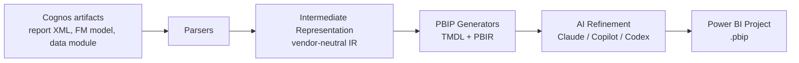

# Cognos to Power BI Migration Tool

**Migrate IBM Cognos reports and models to Microsoft Power BI automatically.** An open-source,
AI-assisted migration engine that converts Cognos report specifications into Power BI Project
(PBIP) format using TMDL semantic models and PBIR report definitions.

[](https://github.com/navintkr/cognos-to-powerbi/actions/workflows/ci.yml)
[](LICENSE)
[](https://www.python.org/downloads/)
[](CONTRIBUTING.md)

---

## What this project does

Organizations moving from **IBM Cognos Analytics** to **Microsoft Power BI** face a slow, manual,
error-prone migration. This tool automates the heavy lifting:

1. **Parse** Cognos report specification XML, Framework Manager models, and data modules.
2. **Normalize** them into a vendor-neutral intermediate representation (IR).
3. **Generate** Power BI Project (PBIP) output: TMDL semantic models and PBIR reports.
4. **Refine** the output with an AI assistant (Claude, GitHub Copilot, or Codex) to translate
   expressions, layouts, and visuals that have no direct mechanical mapping.

The result is a Git-friendly Power BI project you can open in Power BI Desktop, review, and deploy
to the Power BI / Microsoft Fabric service.

## Why use it

- **Faster migrations.** Convert hundreds of reports in a fraction of the manual time.
- **Consistent output.** Deterministic, reviewable PBIP artifacts instead of hand-rebuilt reports.
- **AI-assisted, not AI-dependent.** The mechanical conversion works without any AI key; AI only
  refines what cannot be mapped deterministically.
- **Provider-agnostic AI.** Use Claude Code CLI, GitHub Copilot CLI, or OpenAI Codex CLI.
- **Open and extensible.** MIT-licensed, plugin-friendly parsers and generators.

## Supported conversions

| Cognos source | Power BI target | Status |
| --- | --- | --- |
| Report specification (Report Studio XML) | PBIR report + TMDL tables | Available (beta) |
| Queries and data items | TMDL columns and measures | Available (beta) |
| Framework Manager model (`.cpf` / FM XML) | TMDL semantic model | Available (beta) |
| Data Modules | TMDL semantic model | Planned |
| Dashboards | PBIR report pages | Planned |

See the [migration coverage matrix](docs/coverage.md) for detail on expressions, filters, and
visual types.

## Quick start

```bash
# Install
pip install cognos2powerbi

# Convert a single Cognos report specification to a Power BI project
cognos2pbi migrate ./examples/sample_report.xml --out ./out/SalesReport

# Point the generated model at your database (refreshable PBIP)
cognos2pbi migrate ./examples/sample_report.xml --out ./out/SalesReport \
  --server sql01.contoso.com --database Sales

# Convert a Cognos Framework Manager model to a Power BI semantic model
cognos2pbi migrate-model ./examples/sample_model.xml --out ./out/SalesModel

# Open the generated project
#   ./out/SalesReport/SalesReport.pbip   ->  open in Power BI Desktop
```

Run from source instead:

```bash
git clone https://github.com/navintkr/cognos-to-powerbi.git
cd cognos-to-powerbi
pip install -e ".[dev]"
cognos2pbi migrate ./examples/sample_report.xml --out ./out/SalesReport
```

## AI-assisted refinement (optional)

Enable an AI provider to translate complex Cognos expressions and layouts into Power BI DAX and
PBIR visuals. The provider is selected by configuration and shells out to the corresponding CLI.

```bash
# Claude Code CLI (default)
cognos2pbi migrate ./report.xml --out ./out/Report --ai claude

# GitHub Copilot CLI
cognos2pbi migrate ./report.xml --out ./out/Report --ai copilot

# OpenAI Codex CLI
cognos2pbi migrate ./report.xml --out ./out/Report --ai codex
```

If no AI provider is configured, the tool completes a deterministic conversion and flags items that
need manual review. See [docs/ai-providers.md](docs/ai-providers.md).

## How it works



The intermediate representation decouples parsing from generation, so new Cognos inputs and new
Power BI output formats can be added independently. See [docs/architecture.md](docs/architecture.md).

## Project layout

```
cognos-to-powerbi/
├── src/cognos2powerbi/
│   ├── cli.py                 # Command-line interface
│   ├── core/
│   │   ├── ir/                # Vendor-neutral intermediate representation
│   │   ├── parsers/           # Cognos report/model parsers
│   │   ├── generators/        # PBIP (TMDL + PBIR) generators
│   │   ├── translate/         # Deterministic Cognos-to-DAX translation
│   │   ├── ai/                # Provider-agnostic AI adapter
│   │   └── pipeline.py        # Orchestration
│   └── api/                   # FastAPI backend (SaaS surface)
├── web/                       # Single-page web frontend
├── examples/                  # Sample Cognos inputs
├── docs/                      # Documentation
└── tests/                     # Test suite
```

## Run the SaaS API locally

```bash
pip install -e ".[api]"
uvicorn cognos2powerbi.api.main:app --reload
# Open the web UI at http://127.0.0.1:8000/
# Or POST a Cognos report to http://127.0.0.1:8000/api/v1/migrate
```

## Roadmap

- [x] Framework Manager model conversion to TMDL
- [x] Expression translation library (Cognos to DAX)
- [x] Parameterized data-source wiring for refreshable PBIP
- [ ] Data Module conversion
- [ ] Dashboard to PBIR page mapping
- [ ] Hosted SaaS portal with upload, review, and download
- [ ] Batch / folder migration with a coverage report

Full roadmap: [docs/roadmap.md](docs/roadmap.md).

## Contributing

Contributions are welcome and wanted. Good first issues are labeled
[`good first issue`](https://github.com/navintkr/cognos-to-powerbi/labels/good%20first%20issue).
Read [CONTRIBUTING.md](CONTRIBUTING.md) and the [Code of Conduct](CODE_OF_CONDUCT.md) to get started.

## Security

Report vulnerabilities privately per our [security policy](SECURITY.md). Do not open public issues
for security reports.

## License

Licensed under the [MIT License](LICENSE).

---

### Keywords

Cognos to Power BI, Cognos Power BI migration, IBM Cognos migration tool, convert Cognos reports to
Power BI, Cognos report converter, Power BI PBIP TMDL PBIR generator, business intelligence
migration, automated report migration.
