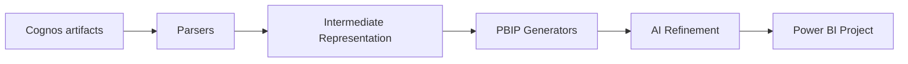

# Architecture

The engine is a four-stage pipeline. Stages communicate only through the intermediate
representation (IR), which keeps Cognos parsing and Power BI generation fully decoupled.

## Stages

1. **Parsers** (`core/parsers`) read a Cognos artifact and populate the IR. The report parser is
   namespace-agnostic so it tolerates multiple Cognos schema versions.
2. **Intermediate representation** (`core/ir`) is a set of Pydantic models describing tables,
   columns, measures, relationships, report pages, and visuals, plus review flags.
3. **Generators** (`core/generators`) read the IR and emit Power BI Project files: TMDL for the
   semantic model and PBIR (`report.json` + `definition.pbir`) for the report.
4. **AI refinement** (`core/ai`) is optional. It translates Cognos expressions that have no
   deterministic mapping into DAX using a pluggable provider.

## Why an intermediate representation

- New Cognos inputs (Framework Manager, data modules, dashboards) only need a new parser.
- New Power BI outputs only need a new generator.
- The deterministic core is fully testable without any AI dependency.

## AI as a refinement layer, not a dependency

The mechanical conversion runs without any API key. AI only fills gaps the deterministic engine
flags. If AI is unavailable, those gaps become review flags rather than failures. This keeps the
tool reliable, reproducible, and safe to run in CI.

## Extending the engine

- Add a parser: implement a function that returns a `MigrationProject` and register it in the
  pipeline.
- Add a generator: implement a class with a `generate(project, out_dir)` method.
- Add an AI provider: subclass `AiProvider` (or `_CliProvider`) and register it in
  `core/ai/providers.py`.
